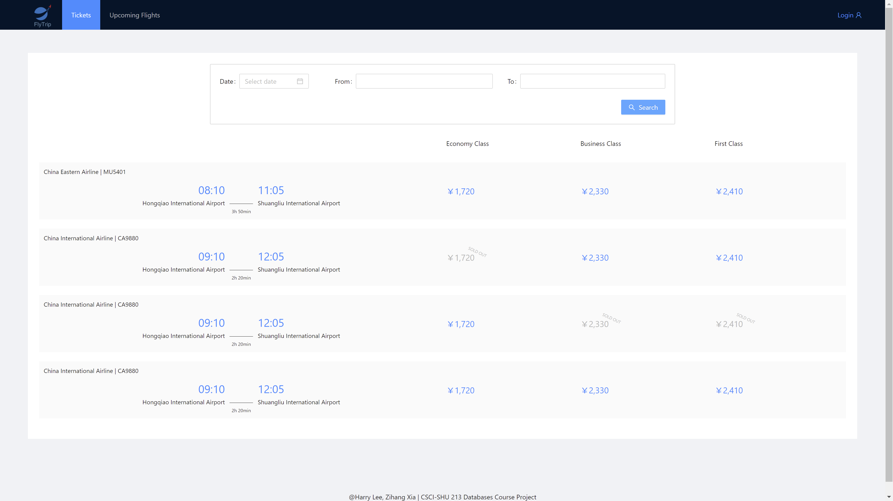

# Flytrip
CSCI-SHU 213 database course project 

Harry Lee [hl3794@nyu.edu](mailto:hl3794@nyu.edu), 
Zihang Xia [zx961@nyu.edu](mailto:zx961@nyu.edu)
## Project Outlook



## Run Project
### Initialize database
For Linux/MacOS
```bash
cd BackEnd
export FLASK_APP=flytrip
flask init-db
```
for Windows
```bat
cd BackEnd
set FLASK_APP=flytrip
flask init-db
```
### Front End Development Server
```bat
cd FrontEnd
npm start
```

### Back End Development Server
for Linux/MacOS
```bash
cd BackEnd
export FLASK_APP=flytrip
export FLASK_ENV=development
flask run
```
for Windows
```bat
cd BackEnd
set FLASK_APP=flytrip
set FLASK_ENV=development
flask run
```

## Project Structure
The following 
- FrontEnd - *The development folder of the front end*
    - build - *The build version of the front end generated by `npm run build`*
        - static - *The resource folder containing the css files and js files*
        - ads.png - *a picture of ad*
        - asset-manifest.json
        - favicon.ico - *the favicon of this web application*
        - **index.html - *homepage, click this to run front end***
        - logo_white.png - *the brand picture*
        - manifest.json - *configuration file*
        - robots.txt - *configuration file*
    - public - *created by `create-react-app`, public folder*
        - ads.png - *a picture of ad*
        - favicon.ico - *the favicon of this web application*
        - index.html - *index file, CANNOT run independently*
        - logo_white.png - *the brand picture*
        - manifest.json - *configuration file*
        - robots.txt - *configuration file*
    - src - *created by `create-react-app`, source folder*
        - pages - *each of the folder represent a page of one type of customer*
            - admin - *__additionlly added__, admin can operate the database*
                - admin.css - *css file for the admin page*
                - admin.js - *React JSX for admin*
            - agent - *page for selling agent*
                - agent.css - *css file for the agent page*
                - agent.js - *React JSX for agent*
            - customer - *page for selling customer*
                - customer.css - *css file for the customer page*
                - customer.js - *React JSX for customer*
            - login - *page for selling agent*
                - cities.json
                - login.css - *css file for the login page*
                - Login.js - *React JSX for login*
                - phoPre.json
            - main - *page for selling agent*
                - main.css - *css file for the main page*
                - main.js - *React JSX for main*
            - staff - *page for selling agent*
                - staff.css - *css file for the staff page*
                - staff.js - *React JSX for staff*
        - index.css - *css file for the index page*
        - index.js - *index page, as a function of router*
        - logo.png - *logo picture*
        - Register.js - *configuration file*
        - reportWebVitals.js - *configuration file*
        - setupTests.js - *configuration file*
- BackEnd
    - flytrip
        - \_\_init__.py - *run back end*
        - api.py - *handle all other requests*
        - auth.py - *handle register, authentication, and login requests*
        - db.py - *set up the database*
        - testData.py - *used in development stage for sending test data to the front end*
    - insert.sql - *insert test data into database*
    - schema.sql - *database schema definition*
    - setup.cfg - *configuration file*
        
## Use Cases
Please refer to [USE_CASES_AND_QUERIES.md](./USE_CASES_AND_QUERIES.md)

## Work Distribution

Harry Lee:
- Design use cases
- Updated database design
- Define APIs
- Front end development
- A little queries

Zihang Xia:
- Back end development
- Front end bug hunting
- Database development

